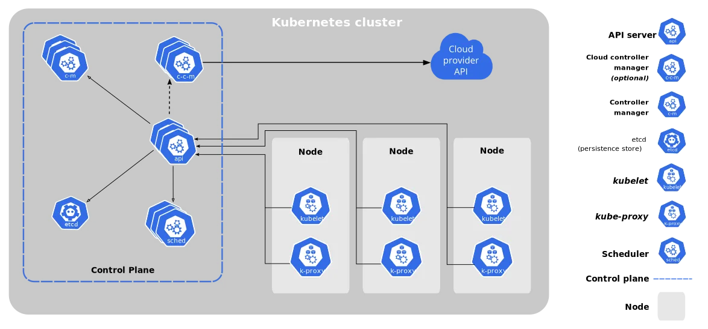

# Containerized Orchestration Tools

 Container orchestration is the process of automating the deployment, scaling, and management of containerized applications. It is a key part of the containerization lifecycle, and it helps to ensure that containerized applications are running reliably and efficiently.
There are many different container orchestration tools available, each with its own strengths and weaknesses. The best tool for you will depend on your specific needs and requirements.

## 1. Kubernetes
Kubernetes is a popular container orchestration platform that is open-source and has become the industry standard for container orchestration, providing a robust and flexible platform for managing container-based applications at scale. It automates the deployment, monitoring, and scaling of applications. Originally developed by Google, Kubernetes is currently maintained by the Cloud Native Computing Foundation (CNCF).

Kubernetes’ capabilities include:

- Container load balancing: Evenly distributes incoming traffic across multiple containers, ensuring optimal performance and preventing overloading of individual containers.

- Automatic release and rollback: Simplifies application deployment by automating the rollout of updates and enabling rollbacks to previous versions if issues occur, ensuring seamless updates and minimal downtime.
- Health tracking: Monitors the health of containers and automatically restarts failed containers, maintaining application reliability and resilience.
- Auto scaling: Adjusts the number of containers based on the workload demand, scaling applications horizontally to maintain responsiveness under varying loads.
- Secret management: Securely stores and manages sensitive information, such as passwords, tokens, and API keys, preventing unauthorized access and ensuring security best practices.

## 2. Red Hat OpenShift

OpenShift is a Platform-as-a-Service (PaaS) offered by Red Hat, built on top of Kubernetes and Docker container technologies. It provides an integrated platform for developers and IT operations teams to build, manage, and deploy containerized applications in a streamlined and efficient manner. OpenShift combines the power of Kubernetes orchestration with Red Hat’s extensive support and ecosystem.

Key capabilities of OpenShift include:

- Vendor neutrality: Can be deployed on a variety of infrastructure platforms, including on-premises, private and public clouds, and hybrid environments, offering flexibility and preventing vendor lock-in.
- Jenkins pipeline integration: Integrates seamlessly with Jenkins, a popular open-source automation server, enabling continuous integration and continuous delivery (CI/CD) pipelines for rapid application development and deployment.
- Software-defined networking (SDN) support: Includes built-in SDN support, which simplifies network management and enables greater control over traffic flow, security, and network policies.
- Operator Hub integration: Integrates with the Operator Hub, a collection of Kubernetes Operators that extend and automate the management of applications and services on Kubernetes. This enables users to easily discover, install, and manage Operators in their OpenShift clusters.

## 3. Apache Mesos

Mesos is a cluster management tool developed by Apache that can efficiently perform container orchestration. The Mesos framework is open-source, and can easily provide resource sharing and allocation across distributed frameworks. It enables resource allocation using modern kernel features, such as Zones in Solaris and CGroups in Linux. Additionally, Mesos uses Chronos Scheduler to start and stop services, and the Marathon API to scale services and balance loads. To let developers define inter-framework policies, Mesos uses a pluggable application module.

Key features of Apache Mesos include:

- Linear scalability, allowing the deployment of 10,000s of nodes
- Zookeeper integration for fault-tolerant master replication
APIs for developing new applications in Java, C++, etc.
- Graphical User Interface for monitoring the state of your clusters
- LXC isolation between tasks

## 4. Docker Swarm

Swarm is the native container orchestration platform for Docker applications. In Docker, a Swarm is a group of machines (physical or virtual) that work together to run Docker applications. A Swarm Manager controls activities of the swarm, and helps manage the interactions of containers deployed on different host machines (nodes). Docker Swarm fully leverages the benefits of containers, allowing highly portable and agile applications while offering redundancy to guarantee high availability for your applications. Swarm managers also assign workloads to the most appropriate hosts, ensuring proper load balancing of applications. While doing so, the Swarm Manager ensures proper scaling by adding and removing worker tasks to help maintain a cluster’s desired state.

Key features of Docker Swarm include:

- Manager nodes help with load balancing by assigning tasks to the most appropriate hosts
- Docker Swarm uses redundancy to enable high service availability
- Swarm containers are lightweight and portable
- Tightly integrated into the Docker Ecosystem, allowing easier management of containers
- Does not require extra plugins for setup
- Ensures high scalability by balancing loads and bringing up worker nodes when workload increases
- Docker Swarm’s distributed environment allows for decentralized access and collaboration

## 5. Hasicorp Nomad

Nomad is an orchestration platform from Hashicorp that supports containers. It shares a similar philosophy of kubernetes in managing applications at scale.
However, Nomad supports container and non-container workloads.
Nomad comes with good integration of other Hashicorp tools like Consul, Vault, and terraform.

Nomad is a flexible workload orchestrator that enables an organization to easily deploy and manage any containerized or legacy application using a single, unified workflow. Nomad can run a diverse workload of Docker, non-containerized, microservice, and batch applications.

Nomad enables developers to use declarative infrastructure-as-code for deploying applications. Nomad uses bin packing to efficiently schedule jobs and optimize for resource utilization. Nomad is supported on macOS, Windows, and Linux.

- Simplicity: Nomad runs as a single process with zero external dependencies. Operators can easily provision, manage, and scale Nomad. Developers can easily define and run applications.
- Flexibility: Nomad can run a diverse workload of containerized, legacy, microservice, and batch applications. Nomad can schedule service, batch processing and system jobs, and can run on both Linux and Windows.
- Scalability and High Performance: Nomad can schedule thousands of containers per second, scale to thousands of nodes in a single cluster, and easily federate across regions and cloud providers.
- HashiCorp Interoperability: Nomad elegantly integrates with Vault for secrets management and Consul for service discovery and dynamic configuration. Nomad's Consul-like architecture and Terraform-like job specification lower the barrier to entry for existing users of the HashiCorp stack.

 

## Comparison

| Tool | Popularity | Features | Learning curve | Support | Cost |
|---|---|---|---|---|---|
| Kubernetes | `Most popular` | `Wide range of features, including scheduling, load balancing, health checks, and secrets management` | `Steep learning curve` | `Wide range of support options, including community support, commercial support, and training` | `Free and open-source` |
| OpenShift | `Second most popular` | `Includes all of Kubernetes' features, plus additional features such as GitOps, CI/CD, and monitoring` | `Steeper learning curve than Docker Swarm` | `Commercial support available` | `Free and open-source, but commercial support available` |
| Apache Mesos | `Third most popular` | `Supports a wide variety of workloads, including stateless and stateful applications` | `Steeper learning curve than Docker Swarm` | `Commercial support available` | `Free and open-source, but commercial support available` |
| Docker Swarm | `Less popular` | `Simpler than Kubernetes, but with fewer features` | `Shallower learning curve than Kubernetes and Mesos` | `Community support only` | `Free and open-source` |
| HashiCorp Nomad | `Less popular` | `Simpler than Kubernetes and Mesos, but with fewer features` | `Shallower learning curve than Kubernetes and Mesos` | `Community support only` | `Free and open-source` |

 

 The best container orchestration tool for you will depend on your specific needs and requirements. If you are looking for a powerful and feature-rich system, Kubernetes is a good choice. If you are looking for a turnkey container platform with a wide range of features, OpenShift is a good choice. If you need a flexible container orchestration system, Apache Mesos is a good choice. If you are new to container orchestration, Docker Swarm is a good choice. And if you want a lightweight container orchestration system, HashiCorp Nomad is a good choice.
