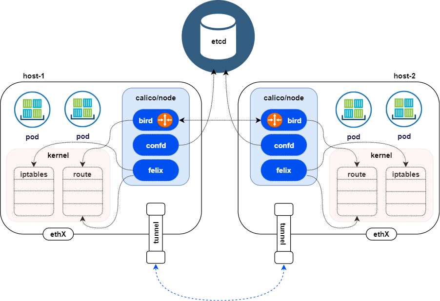
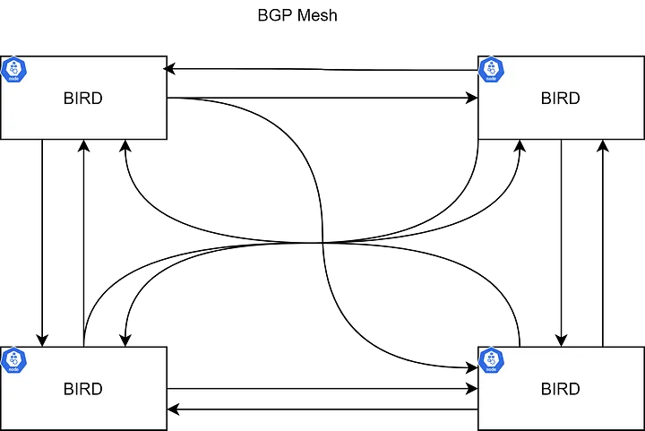
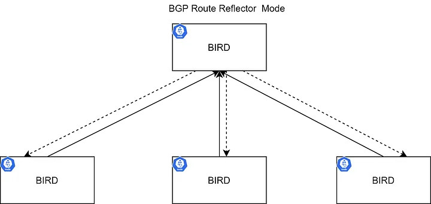
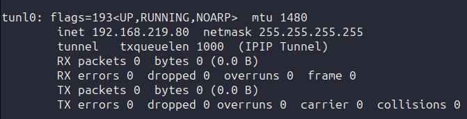
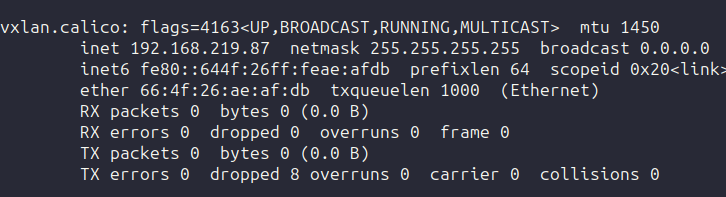

# Calico

Calico Opens in a new tab is an open source community project that provides networking for containers and virtual machines.

Calico is built on the third layer, also known as Layer 3 or the network layer, of the Open System Interconnection (OSI) model. Calico uses the Border Gateway Protocol (BGP) to build routing tables that facilitate communication among agent nodes. By using this protocol, Calico networks offer better performance and network isolation.

Calico implements the Kubernetes Container Network Interface (CNI) as a plug-in and provides agents for Kubernetes to provide networking for containers and pods.

Calico by default creates a BGP mesh between all nodes of the cluster and broadcasts the routes for container networks to all worker nodes. Each node is configured to act as a Layer 3 gateway for the subnet. The subnet is assigned to the worker node and serves the connectivity to pod subnets that are hosted on the host. All nodes participate in the BGP mesh, which advertises all of the local routes that the worker nodes own to all other nodes. BGP peers that are external to the cluster can participate, but the size of the cluster affects how many BGP advertisements these external peers receive. Route reflectors might be required when the cluster scales pass a certain size. 

When routing pod traffic, Calico uses the system capabilities such as the node's local route tables and iptables. All pod traffic traverses iptables rules before they are routed to their destination.

## Calico components

1- calico/node agent

2- calico/cni

3- calico/kube-controller

### calico/node agent

This entity consists of three components - felix, bird, and confd.

- The primary responsibility of felix is to program the host iptables and routes to provide the connectivity that you want to and from the pods on that host.
- bird is an open source BGP agent for Linux® that is used to exchange routing information between the hosts. The routes that are programmed by felix are picked up by bird and distributed among the cluster hosts.
- confd monitors the etcd data store for changes to the BGP configuration, such as IP Address Management (IPAM) information and autonomous system (AS) number. It also changes the bird configuration files and triggers bird to reload these files on each host. The calico/node agent creates veth-pairs to connect the pod network namespace with the host's default network namespace.

### calico/cni

The CNI plug-in provides the IPAM functions by provisioning IP addresses for the pods that are hosted on the nodes.

The Calico node runs in a Docker container on the Kubernetes master node and on each Kubernetes worker node in the cluster. The calico-cni plugin integrates directly with the Kubernetes kubelet process on each node to discover which Pods are created and add them to Calico networking.

### calico/kube-controller

The calico/kube-controller watches Kubernetes NetworkPolicy objects and keeps the Calico data store in sync with the Kubernetes objects. The calico/node that is running on each node uses the information in the Calico etcd data store to program the local iptables.

### calicoctl

calicoctl is a command-line tool that can be used to manage the Calico network and security policies and other Calico configurations. It communicates directly with etcd to manipulate the data store. It provides a number of resource management commands and can be used to troubleshoot Calico network issues. To set up your Calico CLI, see Installing the Calico CLI (calicoctl).

---

The core components of Calico are Bird, Felix, ConfD, Etcd, and Kubernetes API Server. The data-store is used to store the config information(ip-pools, endpoints info, network policies, etc.). In our example, we will use Kubernetes as a Calico data store.

### BIRD (BGP)

The bird is a per-node BGP daemon that exchanges route information with BGP daemons running on other nodes. The common topology could be node-to-node mesh, where each BGP peers with every other.

For large scale deployments, this can get messy. There are Route Reflectors for completing the route propagation (Certain BGP nodes can be configured as Route Reflectors) to reduce the number of BGP-BGP connections. Rather than each BGP system having to peer with every other BGP system with the AS, each BGP speaker instead peers with a router reflector. Routing advertisements sent to the route reflector are then reflected out to all of the other BGP speakers. For more information, please refer to the RFC4456.

The BIRD instance is responsible for propagating the routes to other BIRD instances. The default configuration is ‘BGP Mesh,’ and this can be used for small deployments. In large-scale deployments, it is recommended to use a Route reflector to avoid issues. There can be more than one RR to have high availability. Also, external rack RRs can be used instead of BIRD.

### ConfD

ConfD is a simple configuration management tool that runs in the Calico node container. It reads values (BIRD configuration for Calico) from etcd, and writes them to disk files. It loops through pools (networks and subnetworks) to apply configuration data (CIDR keys), and assembles them in a way that BIRD can use. So whenever there is a change in the network, BIRD can detect and propagate routes to other nodes.

### Felix

The Calico Felix daemon runs in the Calico node container and brings the solution together by taking several actions:

- Reads information from the Kubernetes etcd
- Builds the routing table
- Configures the IPTables (kube-proxy mode IPTables)
- Configures IPVS (kube-proxy mode IPVS)

---

## Routing Modes

- IP-in-IP: default; encapsulated
- Direct/NoEncapMode: unencapsulated (Preferred)
- VXLAN: encapsulated (No BGP)

### IP-in-IP

IP-in-IP is a simple form of encapsulation achieved by putting an IP packet inside another. A transmitted packet contains an outer header with host source and destination IPs and an inner header with pod source and destination IPs.

Azure doesn’t support IP-IP (As far I know); therefore, we can’t use IP-IP in that environment. It’s better to disable IP-IP to get better performance.

### NoEncapMode

In this mode, send packets as if they came directly from the pod. Since there is no encapsulation and de-capsulation overhead, direct is highly performant.

Source IP check must be disabled in AWS to use this mode.

### VXLAN

VXLAN stands for Virtual Extensible LAN. VXLAN is an encapsulation technique in which layer 2 ethernet frames are encapsulated in UDP packets. VXLAN is a network virtualization technology. When devices communicate within a software-defined Datacenter, a VXLAN tunnel is set up between those devices. Those tunnels can be set up on both physical and virtual switches. The switch ports are known as VXLAN Tunnel Endpoints (VTEPs) and are responsible for the encapsulation and de-encapsulation of VXLAN packets. Devices without VXLAN support are connected to a switch with VTEP functionality. The switch will provide the conversion from and to VXLAN.

VXLAN is great for networks that do not support IP-in-IP, such as Azure or any other DC that doesn’t support BGP.

---

There are some differences between VXLAN and IPIP in the context of Calico:

**Encapsulation Format:**

VXLAN: It encapsulates the original Ethernet frame inside a UDP packet, using a VXLAN header. The VXLAN header contains the VNI (VXLAN Network Identifier), which is used to identify the virtual network.

IPIP: It encapsulates the entire IP packet inside another IP packet, with an additional IP header. The original IP packet becomes the payload of the outer IP packet.

**Protocol Support:**

VXLAN: It is an industry-standard overlay protocol widely supported by various networking vendors and devices.

IPIP: It is a generic tunneling protocol supported by most operating systems and network devices.

**Performance:**

VXLAN: It offers better performance compared to IPIP due to the use of UDP encapsulation and efficient hardware offloading support available on modern network equipment.

IPIP: It introduces additional overhead due to the nested IP headers, which can impact performance, especially in high-throughput scenarios.

**MTU Considerations:**

VXLAN: It requires an MTU (Maximum Transmission Unit) of at least 1550 bytes to accommodate the additional VXLAN and UDP headers. This can be a concern when traversing networks with lower MTU values, as it may require fragmentation or cause packet loss.

IPIP: It adds an additional IP header, which increases the packet size. However, since it uses the existing IP infrastructure, it generally does not require a larger MTU size.

**Network Device Support:**

VXLAN: It relies on network devices that support VXLAN encapsulation and decapsulation. Many modern switches and routers have built-in VXLAN support.

IPIP: It is supported by a wider range of devices since it uses standard IP encapsulation.

**Configuration and Management:**

VXLAN: It typically requires more configuration and management overhead, as it involves setting up VXLAN tunnels and configuring VNI mappings.

IPIP: It is relatively simpler to configure since it uses standard IP encapsulation, which is already supported by most networking devices.

In Calico, both VXLAN and IPIP can be used as tunneling protocols for overlay networking, allowing containers and virtual machines to communicate across different hosts and subnets. The choice between VXLAN and IPIP depends on factors such as performance requirements, network infrastructure, device support, and MTU considerations.

### Cross-subnet overlays

In addition to standard VXLAN or IP-in-IP overlays, Calico also supports “cross-subnet” modes for VXLAN and IP-in-IP. In this mode, within each subnet, the underlying network acts as an L2 network. Packets sent within a single subnet are not encapsulated, so you get the performance of a non-overlay network. Packets sent across subnets are encapsulated, like a normal overlay network, reducing dependencies on the underlying network (without the need to integrate with or make any changes to the underlying network).

**Best practice**1

We recommend using the cross-subnet option with IP in IP or VXLAN to minimize encapsulation overhead. Cross-subnet mode provides better performance in AWS multi-AZ deployments, Azure VNETs, and on networks where routers are used to connect pools of nodes with L2 connectivity.

## Changing calico configuration

You can edit the YAML definition of the IPPool resource with below command. Once you are finished editing the resource, you can save the file and exit the editor. The changes to the IPPool resource will then be applied to the Kubernetes cluster.

    kubectl edit IPPool 

**Configure IP in IP encapsulation for only cross subnet traffic:**

spec.ipipMode: CrossSubnet

spec.natOutgoing: true

after that you can see the tunl0 interface

 

**Configure VXLAN encapsulation for only cross subnet traffic**

spec.vxlanMode: CrossSubnet

spec.natOutgoing: true

    

 

### Calico networking stack for Kubernetes

- calico-kube-controllers: This pod runs the Calico Kubernetes controller, which watches Kubernetes NetworkPolicy objects and keeps the Calico datastore in sync with the Kubernetes objects. This ensures that the Calico network policies are applied to the pods in your Kubernetes cluster.

- calico-node: This pod runs the Calico node agent, which is responsible for configuring and managing networking for pods on the node. The Calico node agent creates and attaches Calico network interfaces to pods, and it also handles routing and forwarding of network traffic between pods.

- calico-typha: The Typha daemon sits between the datastore (such as the Kubernetes API server) and many instances of Felix. Typha's main purpose is to increase scale by reducing each node's impact on the datastore. Services such as Felix and confd connect to Typha instead of connecting directly to the datastore as Typha maintains a single datastore connection on behalf of all its clients. It caches the datastore state and deduplicates events so that they can be fanned out to many listeners.

- csi-node-driver: This pod runs the CSI node driver for Calico, which allows Kubernetes to control Calico CNI using the Container Storage Interface (CSI).

## References

https://dramasamy.medium.com/life-of-a-packet-in-kubernetes-part-2-a07f5bf0ff14

https://docs.tigera.io/calico/latest/networking/configuring/vxlan-ipip

