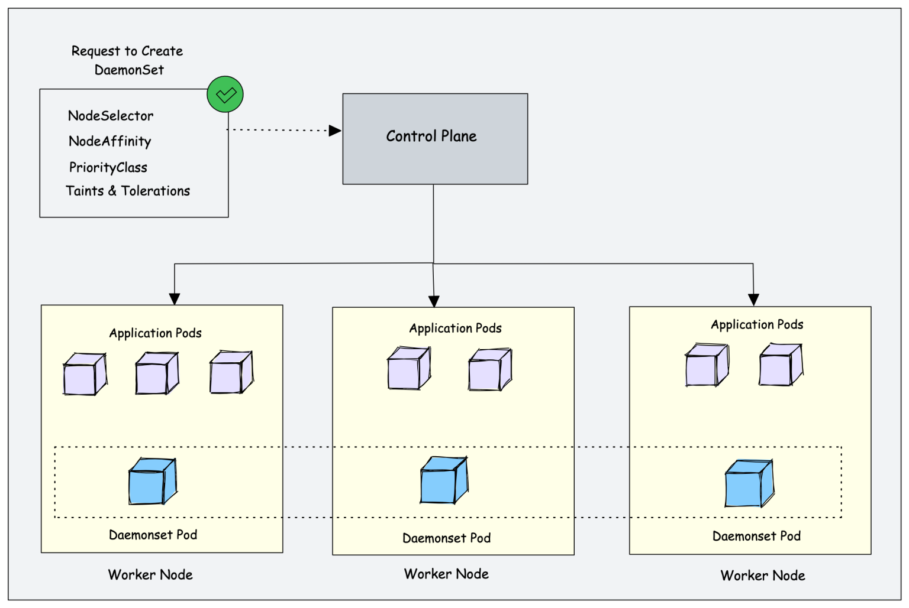

# Kubernetes Components and Architecture 

- Kubernetes follows a client-server architecture. It’s possible to have a multi-master setup (for high availability), but by default there is a single master server which acts as a controlling node and point of contact.

- Kubernetes provides a highly resilient infrastructure with zero downtime deployment capabilities, automatic rollback, scaling, and self-healing of containers.

**Below are the main components on the master node:**

### Kube API server

- The API server is a component of the Kubernetes control plane that exposes the Kubernetes API.
- Kubernetes API server is the central management entity that receives all requests for modifications of pods, services, replication controllers, deployments, etc.
- The API server is the front end of the Kubernetes control plane.
- This is the only component that communicates with the etcd cluster.

### ETCD

- ETCD is a simple, distributed key-value storage that is used to store the Kubernetes cluster data (such as a number of pods, their state, namespace, etc).
- It is only accessible from the API server for security reasons.
- ETCD enables notifications to the cluster about configuration changes with the help of watchers.
- Notifications are API requests on each etcd cluster node to trigger the update of information in the node’s storage.

### Kube Controller Manager

- Controllers take care of actually running the cluster, and the Kubernetes controller-manager contains several controller functions in one.
- Logically, each controller is a separate process, but to reduce complexity, they are all compiled into a single binary known as Kube-controller-manager.

Some types of these controllers are:

- Replication controller: Ensures the correct number of pods is in existence for each replicated pod running in the cluster.
- Node Controller: Monitors the health of each node and notifies the cluster when nodes come online or become unresponsive.
- Endpoints controller: Connects Pods and Services to populate the Endpoints object.
- Service Account and Token controllers: Allocates API access tokens and default accounts to new namespaces in the cluster.

### Kube Scheduler

- The scheduler is responsible to schedule pods in different nodes based on resource utilization.
- It reads the service’s operational requirements and schedules it on the best fit node.
- For example, if the application needs 1GB of memory and 2 CPU cores, then the pods for that application will be scheduled on a node with at least those resources.
- The scheduler runs each time there is a need to schedule pods.
- The scheduler must know the total resources available as well as resources allocated to existing workloads on each node.

**Kubernetes Worker Components**

### Kubelet

- It is a Kubernetes agent that runs on each node in the cluster that communicates with the control plane.
- The kubelet takes a set of PodSpecs that are provided by the API server and ensures that the containers described in those PodSpecs are running and healthy.
- This component also reports about the state and health of the containers.

### Kube Proxy

- Kube-proxy is a network proxy that runs on each node in your cluster.
- Kube-proxy maintains network rules on nodes.
- It also maintains network rules, allows network communication between services and pods, and is responsible for routing network traffic.
- The Kube-proxy handles network communications inside or outside of your cluster.

### Container Runtime Interface

- A container runtime, also known as a container engine, is a software component that is responsible for running containers.
- The kubelet communicates with the container engine through the standard Container Runtime Interface and pulls the docker image from the docker hub.
- Kubernetes also supports container runtimes such as containerd, CRI-O, and any other implementation of the Kubernetes CRI.

### Container Networking

Container networking allows containers, and the applications running within them, to communicate with other containers or hosts.

A commonly used standard for container networking is the Container Network Interface (CNI), a project developed by Red Hat OpenShift, Cloud Foundry, Kubernetes, and others. The CNI is designed to have minimal specifications that only relate to the container’s network connection and the resources allocated when the container is deleted.

**How does Kubernetes work?**

To understand the flow, we will take an example of Nginx pod deployment.

- A user writes a YAML file for pod specification and submits it to the API server, the API server will check for the authentication of that user, and whether the user is authorized to perform the requested actions or not.
- Once the user validation is passed, the API server will store all the data related to pods and their specifications in the ETCD cluster.
- The schedule continuously watches the new request from the API server and once it gets the request from the API server, the scheduler finds the appropriate healthy worker nodes that match the requirement.
- The kubelet further communicates with the container engine through the standard Container Runtime Interface and pulls the docker image from the Docker hub and deploys the pods.
- Controllers watch and monitor the deployed pods and in case of any failure, it reports to the API server.

**Kubernetes Concepts**

- Pod – generally refers to one or more containers that should be controlled as a single application. A pod encapsulates application containers, storage resources, a unique network ID and other configuration on how to run the containers.
- Service – pods are volatile, that is Kubernetes does not guarantee a given physical pod will be kept alive (for instance, the replication controller might kill and start a new set of pods). Instead, a service represents a logical set of pods and acts as a gateway, allowing (client) pods to send requests to the service without needing to keep track of which physical pods actually make up the service.
- Volume – similar to a container volume in Docker, but a Kubernetes volume applies to a whole pod and is mounted on all containers in the pod. Kubernetes guarantees data is preserved across container restarts. The volume will be removed only when the pod gets destroyed. Also, a pod can have multiple volumes (possibly of different types) associated.
- Namespace – a virtual cluster (a single physical cluster can run multiple virtual ones) intended for environments with many users spread across multiple teams or projects, for isolation of concerns. Resources inside a namespace must be unique and cannot access resources in a different namespace. Also, a namespace can be allocated a resource quota to avoid consuming more than its share of the physical cluster’s overall resources.
- Deployment – describes the desired state of a pod or a replica set, in a yaml file. The deployment controller then gradually updates the environment (for example, creating or deleting replicas) until the current state matches the desired state specified in the deployment file. For example, if the yaml file defines 2 replicas for a pod but only one is currently running, an extra one will get created. Note that replicas managed via a deployment should not be manipulated directly, only via new deployments.

### What is a DaemonSet In Kubernetes?

The DaemonSet object is designed to ensure that a single pod runs on each worker node. This means you cannot scale daemonset pods in a node. And for some reason, if the daemonset pod gets deleted from the node, the daemonset controller creates it again.

**Following are the real-world use cases of Daemonset**

- Cluster Log Collection: Running a log collector on every node to centralize Kubernetes logging data. Eg: fluentd , logstash, fluentbit
- Cluster Monitoring: Deploy monitoring agents, such as Prometheus Node Exporter, on every node in the cluster to collect and expose node-level metrics. This way prometheus gets all the required worker node metrics.
- Security and Compliance: Running CIS Benchmarks on every node using tools like kube-bench. Also deploy security agents, such as intrusion detection systems or vulnerability scanners, on specific nodes that require additional security measures. For example, nodes that handle PCI, and PII-compliant data.
- Storage Provisioning: Running a storage plugin on every node to provide a shared storage system to the entire cluster.
- Network Management: Running a network plugin or firewall on every node to ensure consistent network policy enforcement. For example, the Calico CNI plugin runs as Daemonset on all the nodes.

---

### What is CoreDNS?

CoreDNS is a flexible and extensible DNS server that can be used to provide name resolution services for a wide range of applications and services. In the context of Kubernetes, CoreDNS is used to provide DNS-based service discovery and name resolution for pods, services, and other resources within a Kubernetes cluster.

CoreDNS is written in Go and is designed to be lightweight, fast, and efficient. It is also highly configurable, which means that it can be customized to meet the specific needs of different Kubernetes deployments.

---

### Configure Liveness, Readiness and Startup Probes

The kubelet uses **liveness probes** to know when to restart a container. For example, liveness probes could catch a deadlock, where an application is running, but unable to make progress. Restarting a container in such a state can help to make the application more available despite bugs.

A common pattern for liveness probes is to use the same low-cost HTTP endpoint as for readiness probes, but with a higher failureThreshold. This ensures that the pod is observed as not-ready for some period of time before it is hard killed.

The kubelet uses **readiness probes** to know when a container is ready to start accepting traffic. A Pod is considered ready when all of its containers are ready. One use of this signal is to control which Pods are used as backends for Services. When a Pod is not ready, it is removed from Service load balancers.

The kubelet uses **startup probes** to know when a container application has started. If such a probe is configured, liveness and readiness probes do not start until it succeeds, making sure those probes don't interfere with the application startup. This can be used to adopt liveness checks on slow starting containers, avoiding them getting killed by the kubelet before they are up and running.

**Examples**

    livenessProbe:
      exec:
        command:
        - cat
        - /tmp/healthy
      initialDelaySeconds: 5
      periodSeconds: 5

The periodSeconds field specifies that the kubelet should perform a liveness probe every 5 seconds. The initialDelaySeconds field tells the kubelet that it should wait 5 seconds before performing the first probe. To perform a probe, the kubelet executes the command cat /tmp/healthy in the target container. If the command succeeds, it returns 0, and the kubelet considers the container to be alive and healthy. If the command returns a non-zero value, the kubelet kills the container and restarts it.

 

    livenessProbe:
      httpGet:
        path: /healthz
        port: 8080
        httpHeaders:
        - name: Custom-Header
          value: Awesome
      initialDelaySeconds: 3
      periodSeconds: 3

The periodSeconds field specifies that the kubelet should perform a liveness probe every 3 seconds. The initialDelaySeconds field tells the kubelet that it should wait 3 seconds before performing the first probe. To perform a probe, the kubelet sends an HTTP GET request to the server that is running in the container and listening on port 8080. If the handler for the server's /healthz path returns a success code, the kubelet considers the container to be alive and healthy. If the handler returns a failure code, the kubelet kills the container and restarts it.

Any code greater than or equal to 200 and less than 400 indicates success. Any other code indicates failure.

 

    readinessProbe:
      tcpSocket:
        port: 8080
      initialDelaySeconds: 5
      periodSeconds: 10
    livenessProbe:
      tcpSocket:
        port: 8080
      initialDelaySeconds: 15
      periodSeconds: 20

This example uses both readiness and liveness probes. The kubelet will send the first readiness probe 5 seconds after the container starts. This will attempt to connect to the goproxy container on port 8080. If the probe succeeds, the Pod will be marked as ready. The kubelet will continue to run this check every 10 seconds.

In addition to the readiness probe, this configuration includes a liveness probe. The kubelet will run the first liveness probe 15 seconds after the container starts. Similar to the readiness probe, this will attempt to connect to the goproxy container on port 8080. If the liveness probe fails, the container will be restarted.

 

    startupProbe:
    httpGet:
        path: /healthz
        port: liveness-port
    failureThreshold: 30
    periodSeconds: 10

Thanks to the startup probe, the application will have a maximum of 5 minutes (30 * 10 = 300s) to finish its startup. Once the startup probe has succeeded once, the liveness probe takes over to provide a fast response to container deadlocks. If the startup probe never succeeds, the container is killed after 300s and subject to the pod's restartPolicy.

**Configure Probes**

- initialDelaySeconds: Number of seconds after the container has started before startup, liveness or readiness probes are initiated. If a startup probe is defined, liveness and readiness probe delays do not begin until the startup probe has succeeded. Defaults to 0 seconds. Minimum value is 0.
- periodSeconds: How often (in seconds) to perform the probe. Default to 10 seconds. The minimum value is 1.
- timeoutSeconds: Number of seconds after which the probe times out. Defaults to 1 second. Minimum value is 1.
- successThreshold: Minimum consecutive successes for the probe to be considered successful after having failed. Defaults to 1. Must be 1 for liveness and startup Probes. Minimum value is 1.
- failureThreshold: After a probe fails failureThreshold times in a row, Kubernetes considers that the overall check has failed: the container is not ready/healthy/live. For the case of a startup or liveness probe, if at least failureThreshold probes have failed, Kubernetes treats the container as unhealthy and triggers a restart for that specific container. The kubelet honors the setting of terminationGracePeriodSeconds for that container. For a failed readiness probe, the kubelet continues running the container that failed checks, and also continues to run more probes; because the check failed, the kubelet sets the Ready condition on the Pod to false.
- terminationGracePeriodSeconds: configure a grace period for the kubelet to wait between triggering a shut down of the failed container, and then forcing the container runtime to stop that container. The default is to inherit the Pod-level value for terminationGracePeriodSeconds (30 seconds if not specified), and the minimum value is 1. See probe-level terminationGracePeriodSeconds for more detail.

---

### Taints and Tolerations, Node Affinity, and Node Selector

**Taint**

Taint is a feature in Kubernetes that allows users to mark a node as "tainted" with a specific key and value. Pods that do not have toleration for the taint will not be scheduled on the tainted node. Taint can be used to mark nodes as unavailable for certain pods, for example, if the node is undergoing maintenance or has a specific hardware or software configuration that is unsuitable for certain workloads.

To tolerate a taint, you can specify toleration in the pod specification. For example, the following pod specification tolerates the taint "disktype=ssd":

    apiVersion: v1
    kind: Pod
    metadata:
      name: my-pod
    spec:
      tolerations:
      - key: "disktype"
        operator: "Equal"
        value: "ssd"
        effect: "NoSchedule"
      containers:
      - name: my-container
        image: nginx

**Affinity**

1. Node Affinity

	Node affinity allows users to specify which nodes a pod should or should not be scheduled on based on node labels. For example, you can use node affinity to specify that a pod should be scheduled on a node with a specific label, such as disktype=ssd.

	To specify node affinity in a pod specification, use the affinity field and set the nodeAffinity field to the desired node affinity rules. For example, the following pod specification specifies that the pod should be scheduled on a node with the label disktype=ssd:

		apiVersion: v1
		kind: Pod
		metadata:
			name: my-pod
		spec:
			affinity:
				nodeAffinity:
					requiredDuringSchedulingIgnoredDuringExecution:
						nodeSelectorTerms:
						- matchExpressions:
    						- key: disktype
    							operator: In
    							values:
    							- ssd
			containers:
			- name: my-container
				image: nginx

2. Pod Affinity

	Pod affinity allows users to specify which pods a pod should or should not be scheduled with based on labels. For example, you can use pod affinity to specify that a pod should be scheduled on the same node as other pods with a specific label, such as app=database.

	To specify pod affinity in a pod specification, use the affinity field and set the `podAffinity`

**Node selector**

Node selector is a feature in Kubernetes that allows users to specify which nodes a pod should be scheduled on based on node labels. Node selector works by adding labels to nodes and then specifying the desired node labels in the pod specification.

	apiVersion: v1
	kind: Pod
	metadata:
		name: my-pod
	spec:
		nodeSelector:
			disktype: ssd
		containers:
		- name: my-container
			image: nginx

Node selector is similar to node affinity in that both allow users to specify which nodes a pod should be scheduled on based on node labels. However, node selector is a simpler and more primitive mechanism compared to node affinity, which provides more fine-grained control over pod scheduling.

In summary, taint and affinity in Kubernetes allow users to specify rules for pod scheduling based on node attributes, while node selector allows users to specify which nodes a pod should be scheduled on based on node labels. All three mechanisms can be used to control pod scheduling in a cluster and ensure that pods are scheduled on the appropriate nodes based on the requirements of the workload.

### Best Practices

- A combination of Taints & Tolerations and Node Affinity rules can be used together to completely dedicate nodes for specific pods. We use Taints & Tolerations to prevent other pods from being scheduled on the desired nodes and then we use Node Affinity to have our pods scheduled on the desired nodes.
- Taint should be used when you want to mark a node as unavailable for certain pods. For example, you can use taint to mark a node as "maintenance" and prevent pods from being scheduled on the node while it is undergoing maintenance.
- Node affinity should be used when you want to specify which nodes a pod should or should not be scheduled on based on node labels. Node affinity provides more fine-grained control over pod scheduling compared to node selector and allows you to specify complex rules for pod scheduling based on multiple node labels.
- Pod affinity should be used when you want to specify which pods a pod should or should not be scheduled with based on labels. Pod affinity can be used to ensure that certain pods are co-located on the same node or to ensure that certain pods are separated from each other.
- Node selector should be used when you want to specify which nodes a pod should be scheduled on based on node labels, but do not need the fine-grained control provided by node affinity. Node selector is a simpler and more primitive mechanism compared to node affinity and is sufficient for many use cases.

---

### Kubernetes Cluster Best Practices

- **Use namespaces** to prevent unauthorized access and use of cluster resources. Namespaces can help you create logical cluster partitions, which ensure users can concurrently use the same cluster resources.
- **Set up resource requests and limits** to ensure a user or application does not drain cluster resources. You can do this on the cluster level, and also define this in the container spec. 
- **Autoscale clusters** you can leverage built-in features of Kubernetes, such as Cluster Autoscaler and Horizontal Pod Autoscaler, to automatically maintain the capacity, ensure overall health, and avoid downtimes. 
- **Secure clusters with role-based access controls (RBAC)** this is a functionality that enables you to implement access policies that limit user access and privileges. You can define a role for each namespace resource and a ClusterRole for other resources.

---

### Kubernetes Requests

Kubernetes defines requests as a guaranteed minimum amount of a resource to be used by a container.

Basically, it will set the minimum amount of the resource for the container to consume.

When a Pod is scheduled, kube-scheduler will check the Kubernetes requests in order to allocate it to a particular Node that can satisfy at least that amount for all containers in the Pod. If the requested amount is higher than the available resource, the Pod will not be scheduled and remain in Pending status.

In this example, in the container definition we set a request for 100m cores of CPU and 4Mi of memory:

	resources:
	requests:
			cpu: 0.1
			memory: 4Mi

### Kubernetes Limits

Kubernetes defines limits as a maximum amount of a resource to be used by a container.

This means that the container can never consume more than the memory amount or CPU amount indicated.

    resources:
      limits:
        cpu: 0.5
        memory: 100Mi

**CPU particularities**

CPU is a compressible resource, meaning that it can be stretched in order to satisfy all the demand. In case that the processes request too much CPU, some of them will be throttled.

CPU represents computing processing time, measured in cores. 

You can use millicores (m) to represent smaller amounts than a core (e.g., 500m would be half a core)
The minimum amount is 1m

**Memory particularities**

Memory is a non-compressible resource, meaning that it can’t be stretched in the same manner as CPU. If a process doesn’t get enough memory to work, the process is killed.

Memory is measured in Kubernetes in bytes.

You can use, T, G, M, k to represent Terabyte, Gigabyte, Megabyte and kilobyte. (e.g., 500M, 4G)
Warning: don’t use lowercase m for memory (this represents Millibytes, which is ridiculously low)

## References

https://kubernetes.io

https://mrdevsecops.medium.com/kubernetes-architecture-in-depth-b5b909b10d77

https://www.aquasec.com/cloud-native-academy/kubernetes-101/kubernetes-architecture/

https://medium.com/saas-infra/taints-and-tolerations-node-affinity-and-node-selector-explained-f329653c2bc6
