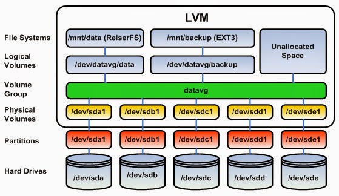

## Process Monitoring

- [ps](https://www.sysadmin.md/ps-cheatsheet.html) \- report a snapshot of the current processes.
    
- [top](https://gist.github.com/ericandrewlewis/4983670c508b2f6b181703df43438c37) \- display Linux processes.
    
- [htop](https://www.maketecheasier.com/power-user-guide-htop/) \- interactive process viewer.
    
- atop - advanced interactive monitor to view the load on a Linux system.
    
- lsof - list open files.
    

## Performance Monitoring

- nmon - A system monitor tool for Linux and AIX systems.
- iostat - A tool that reports CPU statistics and input/output statistics for devices, partitions and network filesystems.
- sar - A system monitor command used to report on various system loads, including CPU activity, memory/paging, device load, network.
- vmstat - A tool that reports virtual memory statistics.

## Networking Tools

- traceroute - Traces the route taken by packets over an IP network.
- ping - sends echo request packets to a host to test the Internet connection.
- mtr - Combines the functionality of traceroute and ping into a single diagnostic tool.
- nmap - Scans hosts for open ports.
- netstat - Displays network connections, routing tables, interface statistics, masquerade connections, and multicast memberships.
- ufw and firewalld - Firewall management tools.
- iptables and nftables - Firewall management tools.
- tcpdump - Dumps traffic on a network.
- dig - DNS lookup utility.
- scp - Secure copy.

## Text Manipulation

- awk - A programming language designed for text processing and typically used as a data extraction and reporting tool.
- sed - A stream editor for filtering and transforming text.
- grep - A command-line utility for searching plain-text data sets for lines that match a regular expression.
- egrep
- sort - A command-line utility for sorting lines of text files.
- cut - A command-line utility for cutting sections from each line of files.
- uniq - A command-line utility for reporting or omitting repeated lines.
- cat - A command-line utility for concatenating files and printing on the standard output.
- echo - A command-line utility for displaying a line of text.
- fmt - A command-line utility for simple optimal text formatting.
- tr - A command-line utility for translating or deleting characters.
- nl - A command-line utility for numbering lines of files.
- wc - A command-line utility for printing newline, word, and byte counts for files.

* * *
    
1.  vim  
    x,X -> delete one char  
    r -> replace one char  
    o,O -> open new line 
    a -> append (you can use it instead of i) 
    u -> undo 
    dw -> delete a word 
    dd -> delete a line 
    J -> join two lines 
    G -> go to line(G, 12G, 1G) 
    y -> yank/copy (yy, yw)  
    p, P(paste) 
    / -> search - then you can use 'n' to go next match 
    $ -> end of the line  
    ^ -> start of the line  
    . -> repeat last thing you done  

* * *

2.  [tmux](https://danielmiessler.com/p/tmux)

    
2.  nano
    
3.  iptables
    
4.  du
    
5.  history

7. watch: use it when you want run a command repeatedly
8. truncate: shrink or extend the size of a file to the specified size
9. lsblk: list block devices
10. diff: compare files line by line

---
## LVM

* pvdisplay: gives you information about physical volume
* vgdisplay: display details about the volume group
* lvdisplay: logical volume
* pvcreate: convert hard drvie into a physical volume for lvm
* vgextend: if you have free physical volume you can extend volume group with this command 
* lvextend: extend logical volume
* resize2fs: extend filesystem
<nl>
lvextend --resizefs -l +100%FREE /dev/mapper/vg_name ->
used to extend the size of a Logical Volume and resize the filesystem associated with it

---
## Systemd
unit directories sorted by their priority:
1. /etc/systemd/system
2. /run/systemd/system
3. /lib/systemd/system

for more information [click here](https://access.redhat.com/documentation/en-us/red_hat_enterprise_linux/8/html/configuring_basic_system_settings/assembly_working-with-systemd-unit-files_configuring-basic-system-settings)