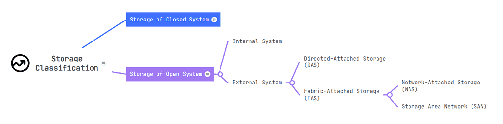
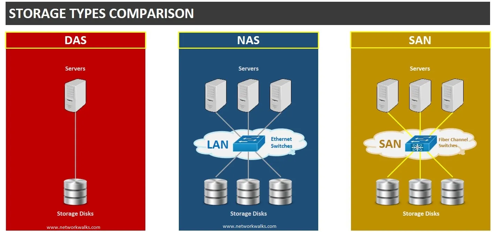

## Process Monitoring

- [ps](https://www.sysadmin.md/ps-cheatsheet.html) \- report a snapshot of the current processes.
    
- [top](https://gist.github.com/ericandrewlewis/4983670c508b2f6b181703df43438c37) \- display Linux processes.
    
- [htop](https://www.maketecheasier.com/power-user-guide-htop/) \- interactive process viewer.
    
- atop - advanced interactive monitor to view the load on a Linux system.
    
- lsof - list open files.
    

## Performance Monitoring

- nmon - A system monitor tool for Linux and AIX systems.
- iostat - A tool that reports CPU statistics and input/output statistics for devices, partitions and network filesystems.
- sar - A system monitor command used to report on various system loads, including CPU activity, memory/paging, device load, network.
- vmstat - A tool that reports virtual memory statistics.

## Networking Tools

- traceroute - Traces the route taken by packets over an IP network.
- ping - sends echo request packets to a host to test the Internet connection.
- mtr - Combines the functionality of traceroute and ping into a single diagnostic tool.
- nmap - Scans hosts for open ports.
- netstat - Displays network connections, routing tables, interface statistics, masquerade connections, and multicast memberships.
- ufw and firewalld - Firewall management tools.
- iptables and nftables - Firewall management tools.
- tcpdump - Dumps traffic on a network.
- dig - DNS lookup utility.
- scp - Secure copy.

## Text Manipulation

- awk - A programming language designed for text processing and typically used as a data extraction and reporting tool.
- sed - A stream editor for filtering and transforming text.
- grep - A command-line utility for searching plain-text data sets for lines that match a regular expression.
- egrep
- sort - A command-line utility for sorting lines of text files.
- cut - A command-line utility for cutting sections from each line of files.
- uniq - A command-line utility for reporting or omitting repeated lines.
- cat - A command-line utility for concatenating files and printing on the standard output.
- echo - A command-line utility for displaying a line of text.
- fmt - A command-line utility for simple optimal text formatting.
- tr - A command-line utility for translating or deleting characters.
- nl - A command-line utility for numbering lines of files.
- wc - A command-line utility for printing newline, word, and byte counts for files.

# Storage Management
/media is supposed to be the mount point for removable media while /mnt is for temporary mounts initiated by the user
- lsblk: list block devices
- du: 
- df -h: displays information about file system disk space usage on the mounted file system.
- ncdu
- fdisk: create, delete, resize, change and move partitions on the hard drive
    - sudo fdisk /dev/sdx ->
      - p: print the current partiton table
      - m: use it to find what command you want
- mkfs: format the partition with whatever file system type you want
   - mkfs.exfat -> using on mulitple os
   - mkfs.ext4 -> using on linux machine
- mount/umount: 
    - in mount 
  
 

## Storage Modes

<table class="has-fixed-layout"><thead><tr><th></th><th> SAN</th><th> NAS</th><th> DAS</th></tr></thead><tbody><tr><td><strong>Type of storage</strong></td><td>Blocks</td><td>Shared files</td><td>Sectors</td></tr><tr><td><strong>Transmission of data</strong></td><td>Fiber Channel</td><td>Ethernet, TCP/IP</td><td>IDE/SCSI</td></tr><tr><td><strong>Speed</strong></td><td>5-10 ms</td><td>20-50 ms</td><td>5-10 ms</td></tr><tr><td><strong>Complexity</strong></td><td>High</td><td>Moderate</td><td>Easy</td></tr><tr><td><strong>Mode of Access</strong></td><td>Servers</td><td>Clients or Servers</td><td>Clients or Servers</td></tr><tr><td><strong>Capacity</strong></td><td>&gt; 10^12 bytes</td><td>10^9-10^12 bytes</td><td>10^9 bytes</td></tr><tr><td><strong>Usage</strong></td><td>Application data</td><td>Unstructured, Shared data</td><td>OS</td></tr></tbody></table>

## LVM

* pvdisplay: gives you information about physical volume
* vgdisplay: display details about the volume group
* lvdisplay: logical volume
* pvcreate: convert hard drvie into a physical volume for lvm
* vgextend: if you have free physical volume you can extend volume group with this command 
* lvextend: extend logical volume
* resize2fs: extend filesystem
<nl>
lvextend --resizefs -l +100%FREE /dev/mapper/vg_name ->
used to extend the size of a Logical Volume and resize the filesystem associated with it

## 

* * *
    
##  vim 
    h,j,k,l -> move cursor 
    x,X -> delete one char ****
    r -> replace one char 
    o,O -> open new line
    a -> append (you can use it instead of i)
    u -> undo
    dw -> delete a word
    dd -> delete a line
    J -> join two lines
    G -> go to line(G, 12G, 1G)
    y -> yank/copy (yy, yw) 
    p, P(paste)
    / -> search - then you can use 'n' to go next match
    $ -> end of the line 
    ^ -> start of the line 
    . -> repeat last thing you done 
    v -> visual mode (you can select) 
    : set nubmer/nonumber -> for add/remove line number

* * *

1.  [tmux](https://danielmiessler.com/p/tmux)
    
2.  iptables
    
3.  history
4.  ssh:
    - ssh logs stores in /var/log/auth.log
    - in ~/.ssh/config file you can add your ssh server details to improves the efficiency, security, and manageability of your SSH connections 
    
    - you should add your public key in .ssh/authorized_keys directory on server
    - -i: you can add your pulic key file by this option
    - -p: for setting the ssh port
    - ssh config file on server stores in /etc/ssh/sshd-config
    - ssh-keygen: use this command to create a new private/public key
      - -C: for adding comment into your pulic key
      -  -t dsa | ecdsa | ecdsa-sk | ed25519 | ed25519-sk | rsa Specifies the type of key to create.

5. watch: use it when you want run a command repeatedly
6. truncate: shrink or extend the size of a file to the specified size
7. lsblk: list block devices
8. diff: compare files line by line

---
## Systemd
unit directories sorted by their priority:
1. /etc/systemd/system
2. /run/systemd/system
3. /lib/systemd/system

for more information [click here](https://access.redhat.com/documentation/en-us/red_hat_enterprise_linux/8/html/configuring_basic_system_settings/assembly_working-with-systemd-unit-files_configuring-basic-system-settings)