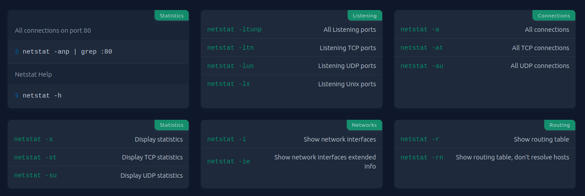
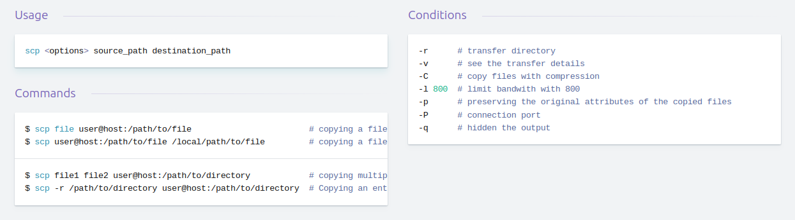
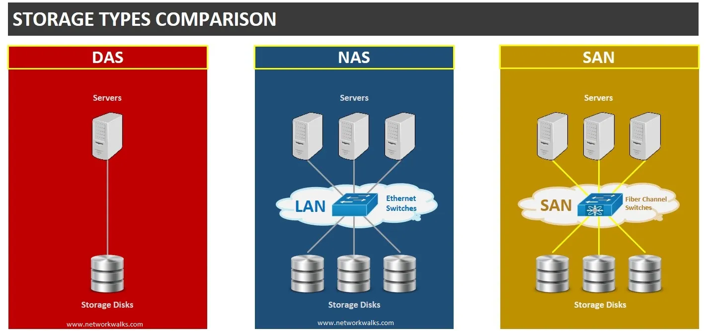

## Process Monitoring

- [ps](https://www.sysadmin.md/ps-cheatsheet.html) \- Report a snapshot of the current processes.
    
- [top](https://gist.github.com/ericandrewlewis/4983670c508b2f6b181703df43438c37) \- Display Linux processes.
    
- [htop](https://www.maketecheasier.com/power-user-guide-htop/) \- Interactive process viewer.
    
- atop - Advanced interactive monitor to view the load on a Linux system.
    
- [lsof](https://www.golinuxcloud.com/lsof-command-in-linux/) - List open files.
    

## Performance Monitoring

- nmon - A system monitor tool for Linux and AIX systems.
- iostat - A tool that reports CPU statistics and input/output statistics for devices, partitions and network filesystems.
- [sar](https://www.geeksforgeeks.org/sar-command-linux-monitor-system-performance/) - A system monitor command used to report on various system loads, including CPU activity, memory/paging, device load, network.
- [vmstat](https://www.geeksforgeeks.org/vmstat-command-in-linux-with-examples/) - A tool that reports virtual memory statistics.

## Networking Tools

- [traceroute](https://www.geeksforgeeks.org/traceroute-command-in-linux-with-examples/) - Traces the route taken by packets over an IP network.
- [ping](https://www.geeksforgeeks.org/ping-command-in-linux-with-examples/) - Sends echo request packets to a host to test the Internet connection.
- [mtr](https://www.tecmint.com/mtr-a-network-diagnostic-tool-for-linux/) - Combines the functionality of traceroute and ping into a single diagnostic tool.
- [nmap](https://www.freecodecamp.org/news/what-is-nmap-and-how-to-use-it-a-tutorial-for-the-greatest-scanning-tool-of-all-time/) - Scans hosts for open ports.
- [netstat](https://quickref.me/netstat.html) - Displays network connections, routing tables, interface statistics, masquerade connections, and multicast memberships.

- [iptables](https://erravindrapawadia.medium.com/iptables-tutorial-beginners-to-advanced-guide-to-linux-firewall-839e10501759) -  Firewall utility that uses policy chains to allow or block traffic that will be enforced by the linux kernel’s netfilter framework. 
- [tcpdump](https://opensource.com/article/18/10/introduction-tcpdump) - Dumps traffic on a network.
- [dig](https://www.cyberciti.biz/files/pdf/dig%20command%20cheat%20sheet.pdf) - DNS lookup utility.
- [ip](https://linuxopsys.com/wp-content/uploads/2023/07/ip-cheat-sheet.pdf) - Show or manipulate routing, devices, and tunnels.
  
- scp - Secure copy
  
- rsync - fast and efficient way to copy and synchronize data across directories, disks, and networks, and can be used for data backups
  - --dry-run: allows you to perform a trial run without making any changes to the system
  - -a: archive mode, which includes all the necessary options like copying files recursively, preserving almost everything (like symbolic links, file permissions, user & group ownership and timestamps).
  - -v: verbose mode, which provides more detailed output during the transfer process.  
  - -z: compresses the file data during the transfer.
  - -P: tells rsync to keep partially transferred files if the transfer is interrupted, so that it can resume the transfer from where it left off instead of starting over from the beginning and tells rsync to display a progress bar during the transfer, showing the percentage of the transfer completed and the estimated time remaining

  ### [rsync vs scp](https://stackoverflow.com/questions/20244585/how-does-scp-differ-from-rsync)

## Text Manipulation

- [awk](https://linuxize.com/post/awk-command/) - A programming language designed for text processing and typically used as a data extraction and reporting tool.
- [sed](https://www.geeksforgeeks.org/sed-command-in-linux-unix-with-examples/) - A stream editor for filtering and transforming text.
- [grep](https://www.geeksforgeeks.org/grep-command-in-unixlinux/) - A command-line utility for searching plain-text data sets for lines that match a regular expression.
- [sort](https://www.geeksforgeeks.org/sort-command-linuxunix-examples/) - A command-line utility for sorting lines of text files.
- [cut](https://bencane.com/2012/10/22/cheat-sheet-cutting-text-with-cut/) - A command-line utility for cutting sections from each line of files.
- [uniq](https://www.geeksforgeeks.org/uniq-command-in-linux-with-examples/) - A command-line utility for reporting or omitting repeated lines.
- [cat](https://www.tecmint.com/cat-command-linux/) - A command-line utility for concatenating files and printing on the standard output.
- [tr](https://linuxopsys.com/topics/tr-command-in-linux) - A command-line utility for translating or deleting characters.
- nl - A command-line utility for numbering lines of files.
- [wc](https://onecompiler.com/cheatsheets/wc) - A command-line utility for printing newline, word, and byte counts for files.

## Storage Management

- blkid: List of device uuid
- lsblk: List block devices
- [du](https://www.redhat.com/sysadmin/du-command-options): Disk usage information  
- df -hi: Displays information about file system disk space and inode usage.
- ncdu: Disk usage analyzer with an ncurses interface
- fdisk: create, delete, resize, change and move partitions on the hard drive
    - sudo fdisk -l: list the partition table of all available disks on a Linux system
    - sudo fdisk /dev/sdx ->
      - p: print the current partiton table
      - m: use it to find what command you want
- mkfs: format the partition with whatever file system type you want
   - mkfs.exfat -> using on mulitple os
   - mkfs.ext4 -> using on linux machine
- mount/umount: 
    - in mount 

> [!NOTE] 
> /media is supposed to be the mount point for removable media while /mnt is for temporary mounts initiated by the user
  
## Storage Modes

|  | SAN | NAS | DAS |
|---|---|---|---|
| **Type of storage** | Blocks | Shared files | Sectors |
| **Transmission of data** | Fiber Channel | Ethernet, TCP/IP | IDE/SCSI |
| **Speed** | 5-10 ms | 20-50 ms | 5-10 ms |
| **Complexity** | High | Moderate | Easy |
| **Mode of access** | Servers | Clients or Servers | Clients or Servers |
| **Capacity** | &gt; 10^12 bytes | 10^9-10^12 bytes | 10^9 bytes |
| **Usage** | Application data | Unstructured, Shared data | OS |

## LVM

* pvdisplay: gives you information about physical volume
* vgdisplay: display details about the volume group
* lvdisplay: logical volume
* pvcreate: convert hard drvie into a physical volume for lvm
* vgextend: if you have free physical volume you can extend volume group with this command 
* lvextend: extend logical volume
* resize2fs: extend filesystem
<nl>
lvextend --resizefs -l +100%FREE /dev/mapper/vg_name ->
used to extend the size of a Logical Volume and resize the filesystem associated with it

## NFS 

* * *
    
##  vim 

### Basic Vim Navigation

* `h`, `j`, `k`, `l` - Move the cursor left, down, up, and right, respectively.
* `$` - Go to the end of the line.
* `^` - Go to the beginning of the line.
* `G` - Go to a specific line number.
* `gg` - Go to the beginning of the file.

### Vim Editing Commands

* `x`, `X` - Delete a single character or a word, respectively.
* `r` - Replace a single character.
* `o`, `O` - Open a new line below or above the current line, respectively.
* `a` - Append text to the end of the current line.
* `u` - Undo the last change.
* `dw` - Delete the current word.
* `dd` - Delete the current line.
* `J` - Join the current line with the next line.
* `y` - Yank (copy) text.
* `p` - Paste text.
* `/` - Search for text.
* `n` - Go to the next match for the search query.

### Vim Visual Mode Commands

* `v` - Enter visual mode.
* `h`, `j`, `k`, `l` - Move the cursor left, down, up, and right, respectively, while selecting text.
* `x`, `X` - Delete the selected text.
* `y` - Yank (copy) the selected text.
* `p` - Paste the selected text.

### Other Useful Tips

* `:` - Enter command mode.
* `set nu/nonumber` - Toggle line numbers.

* * *

## [tmux](https://danielmiessler.com/p/tmux)
 
  ### Session Management

  * `Ctrl` + `b` + `d` - Detach from session
  * `Ctrl` + `b` + `n` - Next session
  * `Ctrl` + `b` + `p` - Previous session
  * `tmux ls` - List sessions

  ### Pane Management

  * `Ctrl` + `b` + `%` - Split pane with horizontal layout
  * `Ctrl` + `b` + `" - Split pane with vertical layout
  * `Ctrl` + `b` + arrow key - Switch to pane to the direction

  ### Window Management

  * `Ctrl` + `b` + `c` - Create window
  * `Ctrl` + `b` + `,` - Rename current window
  * `tmux new -s <session-name>` - Start a new session with the name `<session-name>`
  * `tmux kill-ses -t <session-name>` - Kill session `<session-name>`
  * `tmux a -t <session-name>` - Attach to a session with the name `<session-name>`
  * `tmux a` - Attach to the last session you were connected

---

## ssh
    
### Basic SSH Usage

  * SSH logs are stored in `/var/log/auth.log`.
  * You can add your SSH server details to the `~/.ssh/config` file to improve the efficiency, security, and manageability of your SSH connections.
  * You should add your public key to the `.ssh/authorized_keys` directory on the server.
  * You can use the `-i` option to specify your public key file when connecting to a server.
  * You can use the `-p` option to specify the SSH port when connecting to a server.
  * The SSH configuration file on the server is stored in `/etc/ssh/sshd-config`.
  * You can use the `ssh-keygen` command to generate a new private/public key pair.
      * Use the `-C` option to add a comment to your public key.
      * Use the `-t` option to specify the type of key to generate. Common options include `rsa`, `dsa`, `ed25519` and `ecdsa`.

  ### SSH Port Forwarding

  * You can use SSH port forwarding to forward traffic from one port on your local machine to another port on a remote server.
  * To do this, you can use the `-L` or `-R` options when connecting to the server.
  * For example, to forward traffic from port 8080 on your local machine to port 80 on the remote server, you would use the following command:
  
        ssh -L 8080:localhost:80 user@remote_server

## Generate a Self-Signed Certificate Using OpenSSL
  
**1. Generate Key pair using OpenSSL** 

    openssl genrsa -out private.key 2048 

  This command will generate an `RSA` key pair with a length of `2048`.

**2. Extract the public key from the key pair**
 
    openssl rsa -in private.key -pubout -out public.key
  extract the public key from the key pair generated in step 1.

**3. Generate a Certificate Signing Request (CSR)** 
 
  The next step is to generate a Certificate Signing Request (CSR). This will be used by the certificate authority (CA) to create the self-signed certificate. To generate the CSR, run this command in your terminal:

    openssl req -new -key private.key -out certificate.csr

  We suggest verifying the CSR generated before you submit it to the Certificate Authority. Run this command to verify the details of your CSR.

    openssl req -text -in certificate.csr -noout -verify
The `-noout` switch omits the output of the encoded version of the CSR. The `-verify` switch checks the signature of the file to make sure it hasn't been modified.

**4. Generate the self-signed certificate** 
  
  Finally, generate the self-signed certificate using the private key and CSR. Run this command to generate the self-signed certificate on the terminal:

    openssl x509 -in certificate.csr -out certificate.crt -req -signkey private.key -days 365

  
  What is a self-signed certificate?
  Why might you want to use a self-signed certificate?
  What are the risks of using a self-signed certificate?
  How to install a self-signed certificate on your server and client machines.

 

- [chmod](https://quickref.me/chmod.html)
- [find](https://www.geeksforgeeks.org/find-command-in-linux-with-examples/)
- watch: Runs the specified command repeatedly and displays the results on standard output
- truncate: shrink or extend the size of a file to the specified size
- diff: compare files line by line

---
## Systemd
unit directories sorted by their priority:
1. /etc/systemd/system
2. /run/systemd/system
3. /lib/systemd/system

for more information [click here](https://access.redhat.com/documentation/en-us/red_hat_enterprise_linux/8/html/configuring_basic_system_settings/assembly_working-with-systemd-unit-files_configuring-basic-system-settings)
